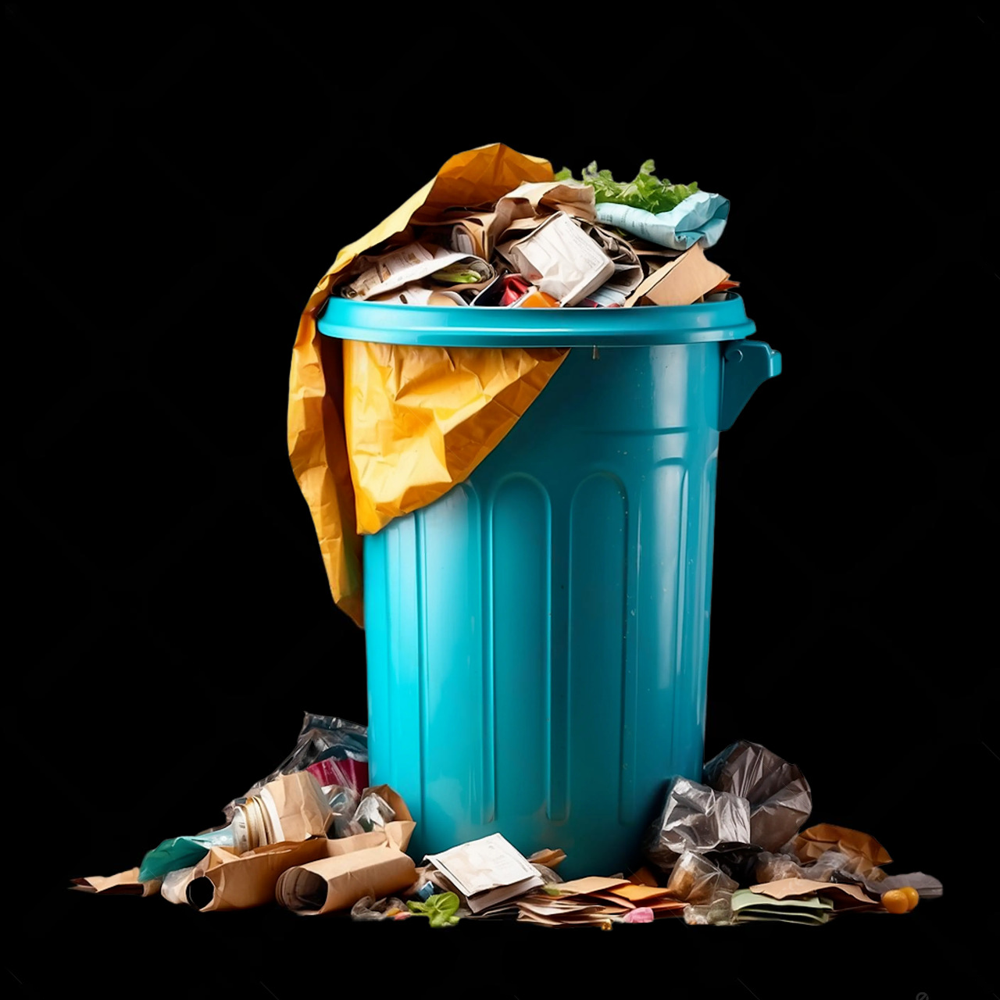

<div>
 
<h1 style="position:relative;left:300px;bottom:30px;color:#00ff00">NOT A DUST BINS</h1>
</div>

# :house: MY BINS

This is a collection of my personal scripts and binaries that I use on a daily basis.

# :hourglass: Installation

```bash
cd bins
./install.sh -i
```
